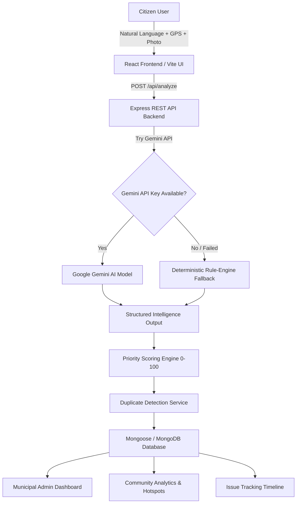

# CivicPulse AI 🏛️✨
> **Turn everyday problems into actionable, prioritized civic intelligence reports.**

CivicPulse AI is an end-to-end, production-quality AI-powered civic issue reporting and municipal intelligence platform. It converts unstructured citizen observations (text descriptions, photos, and GPS coordinates) into structured, categorized, and prioritized municipal action reports using Google Gemini AI, backed by a robust deterministic rule-engine fallback.

---

## 📌 Problem Statement
Citizens frequently encounter civic infrastructure issues such as potholes, garbage accumulation, broken streetlights, water leaks, blocked drains, and public safety hazards. Existing complaint portals are cumbersome, require specialized municipal classification knowledge, lack transparent priority scoring, and fail to prevent duplicate reports.

## 🚀 Solution
CivicPulse AI allows citizens to report problems in natural language. The AI instantly:
1. Classifies the issue into exact municipal categories & subcategories.
2. Assesses severity level (`LOW`, `MEDIUM`, `HIGH`, `CRITICAL`) and public impact.
3. Computes a transparent **Smart Priority Score (0–100)**.
4. Identifies potential geographic duplicate reports within 500 meters.
5. Generates a formal, printable **Municipal Incident Dossier (`CP-2026-XXXXX`)** routed directly to the responsible department.

---

## 🛠️ Architecture & System Design



---

## ✨ Core Features

### 1. 🏠 Modern Landing Page
- Real-time stats: Issues Reported, Issues Resolved, Active Complaints, Communities Reached.
- Interactive 4-step workflow guide.
- Category catalog for Road Damage, Waste, Streetlights, Water & Drainage, Safety, Infrastructure, Parks, and Other.

### 2. 📝 AI-Powered Issue Reporter & Hackathon Demo Mode
- Plain text description textarea.
- Category auto-detection or manual selection.
- Browser Geolocation API ("Use My Location") with exact latitude/longitude display.
- Drag-and-drop image upload with live preview.
- **"Try Demo Issue"** button for instant hackathon evaluation.

### 3. 🧠 Multi-Layer AI Analysis & Priority Scoring
- Generates structured JSON: Category, Subcategory, Severity, Confidence %, Public Impact, Department, Suggested Action, Summary.
- **Smart Priority Score (0–100)** calculated transparently based on severity, public vulnerability factors, high-traffic keywords, and duplicate density.
- **AI Fallback Engine**: If the Gemini API key is unavailable or fails, an intelligent keyword/regex classifier executes seamlessly.

### 4. 🛰️ Duplicate Report Detector
- Scans database for matching open issues within 500m or with similar description tokens.
- Warns user with option to append report or view existing issue.

### 5. 📄 Official Municipal Report Generator
- Formats structured dossier (`CP-2026-00124`).
- Provides copy to clipboard and downloadable formatted text file.

### 6. 🔍 Real-Time Issue Tracker
- Visual 6-step progress timeline: `Reported` → `AI Analyzed` → `Submitted` → `Acknowledged` → `In Progress` → `Resolved`.

### 7. 📊 Community Analytics & Hotspots Dashboard
- KPI summary cards.
- Interactive charts powered by Recharts (Category, Status, Severity, Over Time).
- Location density heatmap visualization.
- **Automated AI Insights Panel** generating data-driven trend intelligence from real MongoDB records.

### 8. 🛡️ Municipal Admin Control Center
- Authority control table with filtering, search, and sorting.
- Department assignment and status transition workflow (`PENDING` → `ACKNOWLEDGED` → `IN_PROGRESS` → `RESOLVED`).
- Mandatory confirmation dialog before resolving reports.

### 9. 🌐 Multilingual Support (English & Tamil)
- Instant toggle button (EN / தமிழ்) providing localized labels across navigation, form fields, and status badges.

---

## 🧰 Tech Stack

- **Frontend**: React 18, Vite, Tailwind CSS, Lucide Icons, Recharts, Canvas Confetti.
- **Backend**: Node.js, Express.js, Mongoose, `@google/generative-ai` SDK, CORS, Dotenv.
- **Database**: MongoDB (with automatic `MongoMemoryServer` fallback for zero-setup execution).
- **Localization**: React Context API (English & Tamil).

---

## ⚙️ Environment Variables

Create `.env` in `backend/`:
```env
PORT=5000
MONGODB_URI=mongodb://127.0.0.1:27017/civicpulse_ai
GEMINI_API_KEY=your_gemini_api_key_here
AI_API_KEY=your_gemini_api_key_here
```
> *Note: If `GEMINI_API_KEY` is omitted, CivicPulse AI automatically uses its deterministic rule engine, ensuring 100% demo availability.*

---

## 🚦 Running Locally

### 1. Backend Setup
```bash
cd backend
npm install
npm start
```
*The backend connects to MongoDB (or launches MongoMemoryServer) and automatically seeds 10 sample Coimbatore civic issues on first launch.*

### 2. Frontend Setup
```bash
cd frontend
npm install
npm run dev
```
Open [http://localhost:3000](http://localhost:3000) in your browser.

---

## 🚀 Scalability & Future Roadmap
- Government WhatsApp & Voice Bot Integration.
- Image-Based Computer Vision Damage Assessment.
- GIS Heatmap Layering (Leaflet / Mapbox).
- Citizen Trust & Community Upvoting System.
- Automated SLA Department Routing Escalations.
